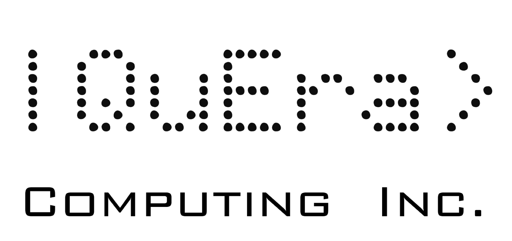

<link href="pandoc.css" rel="stylesheet"></link>

 

  

  

  

  

  

  

   
   
  Sheng-Tao Wang

  Algorithms Team Lead

  QuEra Computing Inc.

  Harvard University 

  1284 Soldiers Field Rd.

  Boston, MA 

  E-mail: swang@quera.com 

  

 

Dear <receiver> Committee,  

 
I am honored to advocate for Blake Wilson's candidacy for the [Fellowship Name]. As Quantum Algorithms and Applications Manager at QuEra Computing Inc., I have mentored and collaborated with numerous bright minds in the realm of quantum computing and machine learning. Blake stands out as one of the most talented and promising among them.

&nbsp;&nbsp; While he was here, he developed a strong connection with the Harvard and MIT researchers at our company. His work is regularly discussed with the faculty that serve on our board. We gave him one-on-one mentorship through our experienced algorithms team, some who have held previous professorship positions, and can guide Blake to prepare for the next stage in his career.  

During his tenure at QuEra, Blake's synergy with our scientists was evident. He took the helm in developing quantum-enhanced machine learning optimization algorithms, which are pivotal for the company's ongoing industry collaborations. Blake afforded us opportunities to expand our network through his connections at the Quantum Science Center, including organizing speaking arrangements for our business developers and CEO to meet with QSC leadership. Additionally, Blake's research plays a crucial step in developing new algorithms for our industry partners. His innovation in introducing new machine learning algorithms for mapping physics and industry engineering problems onto our machine accomplish seemingly insurmountable challenges in quantum computing and machine learning. Notably, his work has opened avenues for industry partners to leverage QuEra's quantum simulator in solving tangible engineering challenges.

Blake's stint at QuEra was not just another addition to his portfolio; it was a period of prolific growth, collaboration, and innovation. With mentorship from our seasoned algorithms team, including those with academic backgrounds as professors, Blake has honed his skills and vision for his academic trajectory. Under my direct mentorship, Blake showcased not just his technical prowess, but also his ability to innovate and lead. His in-depth knowledge, built over 8 years of experience in algorithms design and analysis for machine learning, quantum material measurements, CUDA, supercluster, and HPC programming, has been invaluable to our team. But more than his technical skills, it was his capacity to grasp complex concepts, lead a team of researchers, and drive innovative projects that impressed me the most. From pioneering new deep learning algorithms for quantum engineering to publishing, presenting, and mentoring, Blake's accomplishments are a testament to his dedication and brilliance.

&nbsp;&nbsp;In the realm of quantum computing, Blake's contributions to QuEra Computing, specifically in the development of quantum-enhanced machine learning optimization algorithms, have been exemplary. The ability to demonstrate practical engineering solutions on our neutral atom simulators is no small feat, and Blake's endeavors have successfully invited new industry partners to explore these solutions.

QuEra prides itself on being at the vanguard of academic research in quantum machine learning algorithms, and Blake's contributions have been instrumental in maintaining this position.  Beyond his technical prowess, his dedication, ambition, and drive position him as a promising candidate for an illustrious academic career.

In sum, Blake Wilson exhibits all the qualities of a distinguished scholar, leader, and innovator. I wholeheartedly recommend him for the [Fellowship Name]. Should you require any further information or insights into his stellar contributions, please do not hesitate to contact me.

 

Sheng-Tao Wang

Quantum Algorithms and Applications Manager

QuEra Computing Inc.

